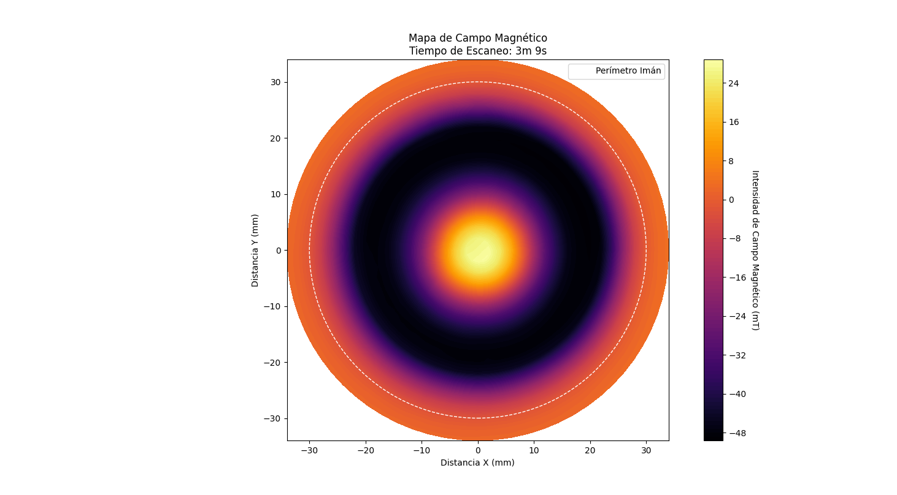
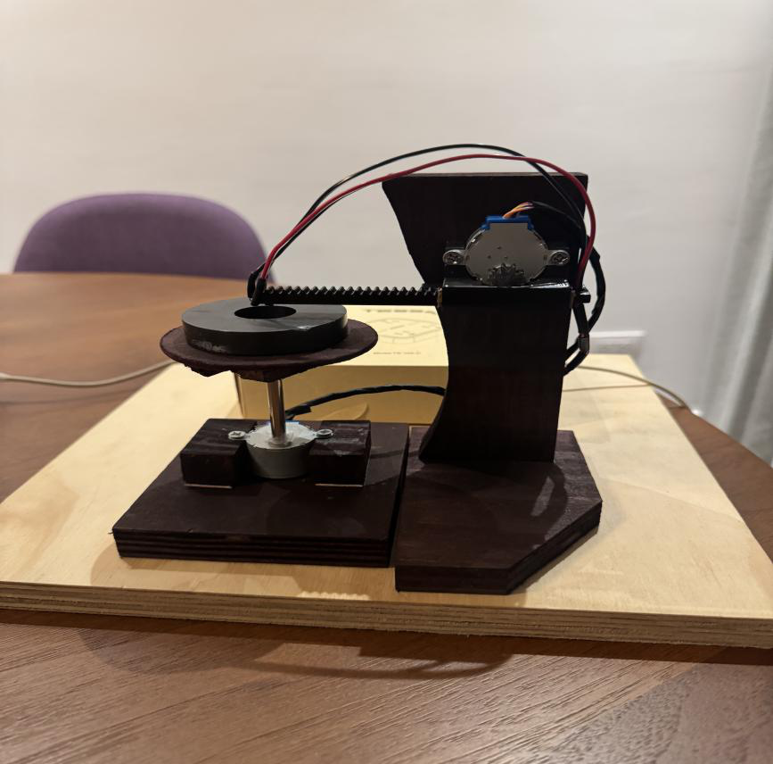
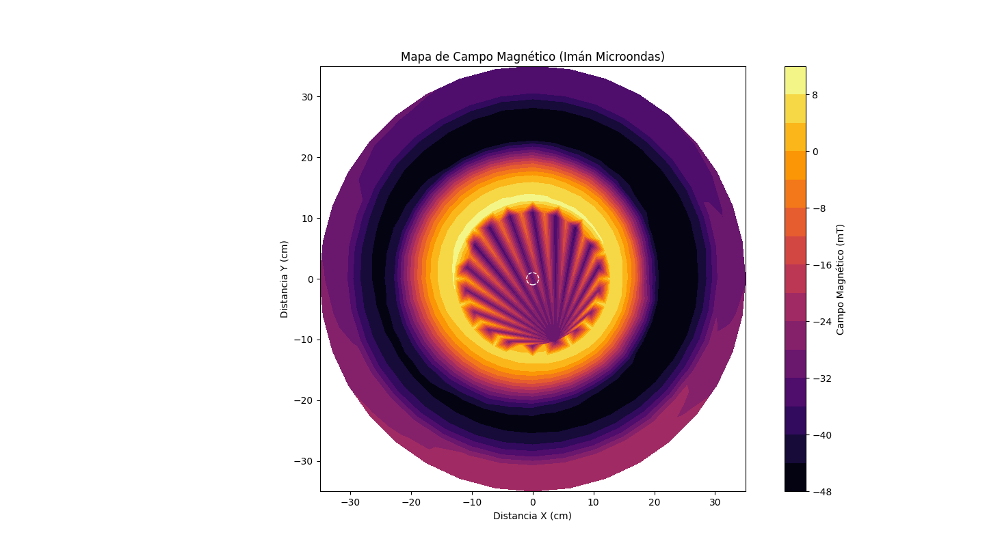
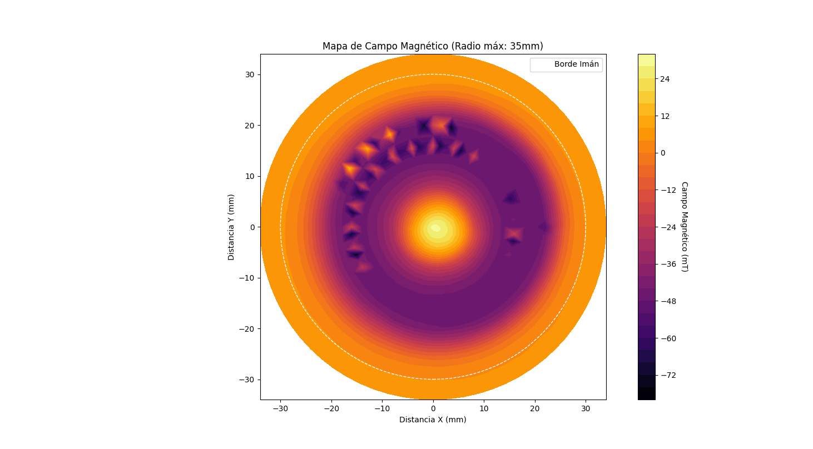
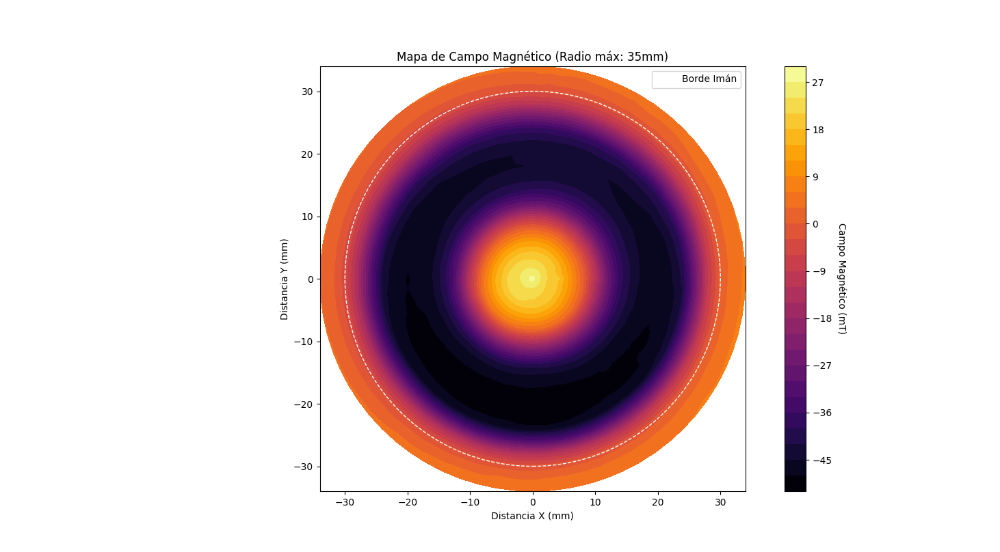
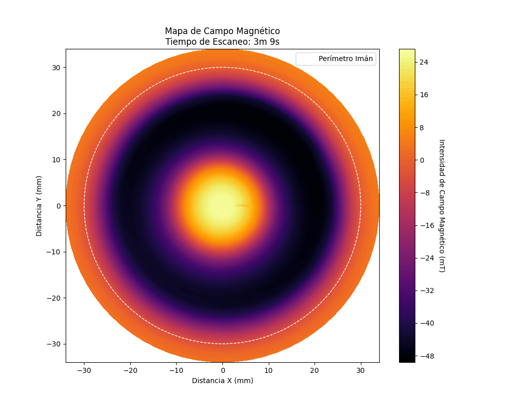
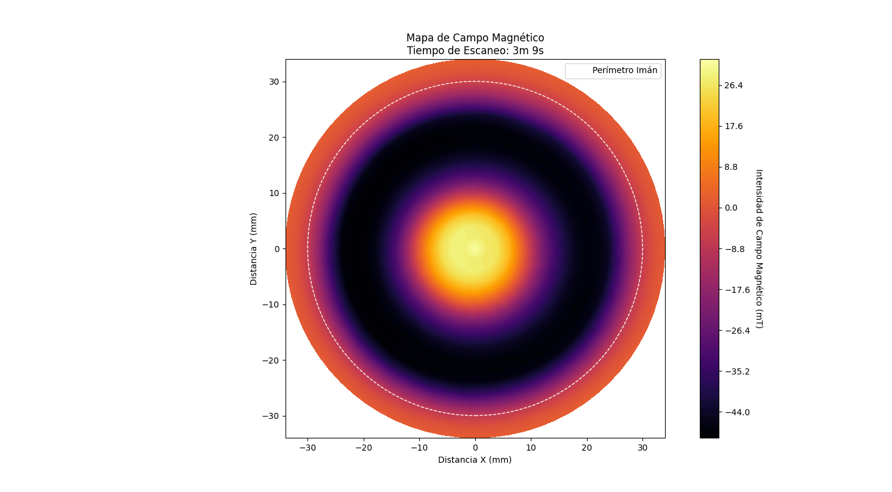
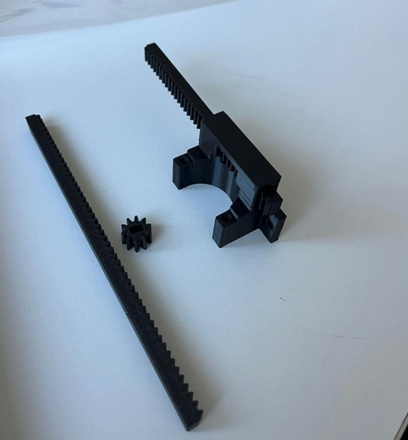
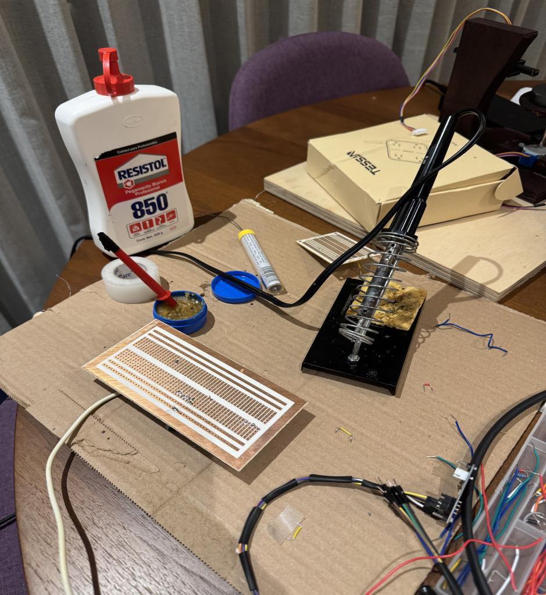

# 2D Magnetic Field Mapper

An automated scanner that measures the magnetic field of a microwave magnetron magnet
across a plane and renders it as a heatmap — built from a wooden base, two hobby stepper
motors, a $2 Hall sensor, and 3D-printed parts.

Each run captures **1,296 measurements** (72 angular positions × 18 radial positions) in
**3 minutes 9 seconds**, at 5° angular and 2 mm radial resolution, and produces a plot like
this:



The bright center and dark ring are the real dipole structure of a toroidal ferrite magnet:
field intensity peaks over the magnet body and reverses polarity past its edge. Measured
values span **−49.08 mT to +28.08 mT**.



---

## How it works

The scanner works in polar coordinates, which suits a round magnet better than a raster grid
and needs only two axes of motion:

1. A stepper rotates the **magnet** a full 360° in 5° increments (28 steps per increment).
2. At each of the 72 angular stops, the ESP32 samples the Hall sensor and streams
   `angle,radius,field` over serial at 115200 baud.
3. A second stepper drives a **rack and pinion** that moves the sensor 2 mm further out.
4. Repeat until 34 mm, then the carriage returns to origin on its own and waits for the next run.

On the PC side, a Python script reads the serial stream live, converts polar coordinates to
Cartesian, and renders an interpolated contour map with `matplotlib.tri` — no gridding or
resampling step required.

### Converting the sensor reading to millitesla

The SS49E is ratiometric — its idle output sits near VCC/2, so the field is the *deviation*
from a measured zero point, not the raw reading:

```
voltage      = (adc_reading / 4095) * 3.3
voltage_zero = (1968        / 4095) * 3.3        // calibrated with no magnet present
gauss        = (voltage - voltage_zero) / 0.00165 // V per Gauss at 3.3 V
millitesla   = gauss / 10
```

`VALOR_ZERO = 1968` is a calibration constant specific to this sensor and supply. It has to
be re-measured if you rebuild this — an incorrect zero shifts the entire field map.

---

## Repository layout

```
firmware/escaner_campo_magnetico.ino   ESP32 firmware: motion control + sensor sampling
analysis/heatmap_magnetico.py          serial capture, polar->cartesian, heatmap, CSV export
data/datos_campo_magnetico.csv         1,296 real readings from the final run
docs/build/                            hardware photos
docs/heatmaps/                         scan results across the debugging process
```

## Running it

```bash
pip install pyserial numpy matplotlib
python analysis/heatmap_magnetico.py
```

Set `PUERTO_SERIAL` in the script to your ESP32's port. The script opens a prompt:

| Key | Action |
|-----|--------|
| `a` / `d` | nudge the carriage to center the sensor before starting |
| `s` | begin the scan |

The heatmap appears when the scan finishes, and raw readings are written to
`datos_campo_magnetico.csv`.

---

## Getting to a clean result

The first scans were unusable. Working out *why* was most of the project, and the scan
history documents the diagnosis:

| Scan | Result | Cause |
|---|---|---|
|  | Something registered, but the center was scrambled | Sensor readings unstable; no signal averaging |
|  | Rings visibly irregular and asymmetric | **False contacts on the breadboard** — the wiring shifted as the carriage moved |
|  | Rings resolve cleanly | Circuit soldered onto perfboard, eliminating intermittent connections |
|  | Concentric but off-center | Sensor plane not level with the magnet |
|  | Centered, well-defined rings | Base leveled and sensor height corrected |

Three fixes did the work:

**Averaging over 10 ADC samples per point.** A single `analogRead` on the ESP32 is noisy
enough to speckle the map. Ten reads at 1 ms intervals cost 10 ms per point — negligible
against the 30 ms the stepper already needs to settle.

**Soldering the circuit to perfboard.** This was the big one. On a breadboard, the moving
carriage tugged its wiring just enough to create intermittent contacts, so the *same* physical
point read differently between runs. The scans were inconsistent rather than wrong, which is
what pointed at connections instead of code.

**Powering the motors from a dedicated 5 V supply.** Four AA cells sagged under stepper load,
costing torque and introducing vibration that blurred position accuracy.

A fourth issue was mechanical: the field map came out visibly tilted because the wooden base
wasn't level. No amount of signal processing fixes that — it needed a shim.

---

## Hardware

| Component | Part | Role |
|---|---|---|
| Microcontroller | ESP32 DevKit V1 | 12-bit ADC, serial streaming |
| Sensor | SS49E linear Hall effect | analog field measurement |
| Motors | 2 × 28BYJ-48 | angular + linear motion |
| Drivers | 2 × ULN2003 | stepper power |
| Supply | 5 V / 1 A external | motor power (ESP32 runs off USB) |
| Mechanism | 3D-printed rack & pinion | rotation → linear travel |
| Magnet | Toroidal ferrite (microwave magnetron) | device under test |

A commercial Steren gear set was tried first but didn't fit the geometry, so the rack, pinion,
and motor mount were modeled and printed instead — visible below.




### Wiring

| Signal | ESP32 GPIO |
|---|---|
| Angular stepper (IN1–IN4) | 13, 14, 12, 27 |
| Linear stepper (IN1–IN4) | 26, 33, 25, 32 |
| Hall sensor output | 34 (ADC1) |

A 100 µF electrolytic capacitor across the supply prevents brownout resets while flashing.

---

## Known limitations

- **Single-axis sensitivity.** The SS49E measures one field component, not the full vector.
  The map shows magnitude along the sensor's axis, not true 3D field direction.
- **Calibration drift.** `VALOR_ZERO` is measured once at startup and assumed constant;
  temperature changes during a long scan will shift it slightly.
- **Angular backlash.** The 28BYJ-48 has play in its gearbox, and 2048/72 rounds to 28 steps,
  accumulating a small angular error over a full rotation.
- **Fixed scan geometry.** Radius and step size are compile-time constants, so changing the
  scan area means reflashing.

---

## Credits

Course project for Electricidad y Magnetismo, Universidad Anáhuac Mayab, December 2025.

**Tomás Altamirano** — concept and system design, electronics, firmware, Python data pipeline,
3D models, soldering, component sourcing, calibration and testing.

**Stephanie Bayona, Isaac Padilla, Alexa Rodríguez** — assistance with woodworking and
fabrication, 3D print logistics, mechanical assembly, and the written report.

## References

- Serway, R. A., & Jewett, J. W. (2014). *Electricidad y Magnetismo* (9th ed.). Cengage Learning.
- Honeywell (2013). *SS49E Linear Hall-Effect Sensor Datasheet*.
- Espressif Systems (2024). *ESP32 Technical Reference Manual*.
